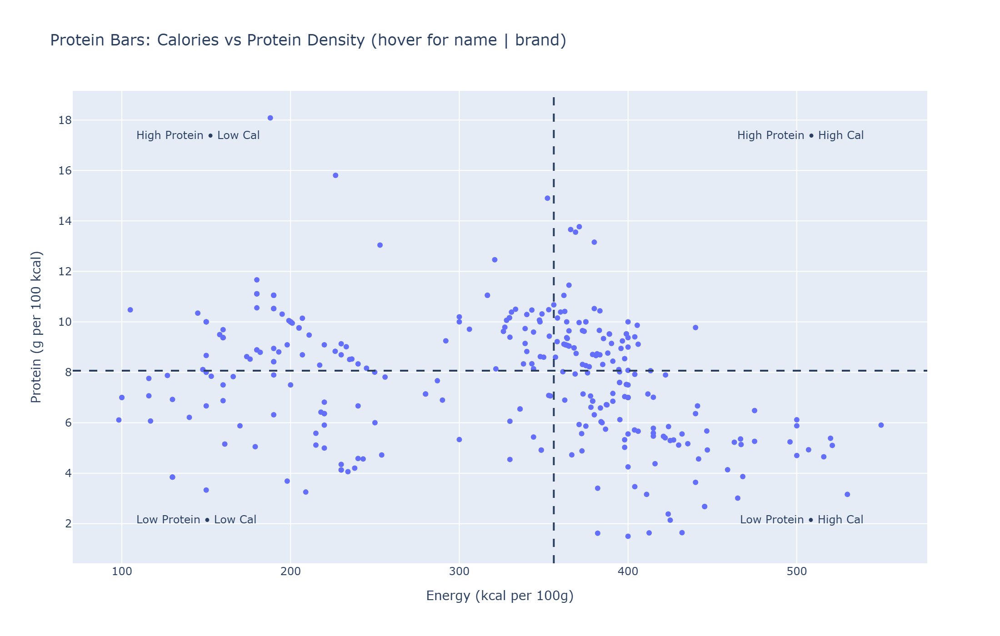

# What Are the Best Protein Bars Available in Ireland?

This project is designed for **consumers aiming to cut** and **trainers looking to guide their clients** on better nutrition choices.  
Protein bars are often marketed with flashy claims — “high protein,” “low sugar,” “healthy fuel” — but not all are truly cutting-friendly.  

Using open-source nutrition data and a structured scoring framework, this project applies **data analysis and machine learning** to cut through the clutter and identify which bars actually support fat loss goals.

---

## Project Goal

The goal of this project is two-fold:

1. **Consumer clarity**  
   Help individuals focused on fat loss make informed choices by ranking protein bars sold in Ireland on their true cutting-friendliness.  

2. **Trainer guidance**  
   Provide a simple, explainable framework that gym trainers and nutrition coaches can use when recommending bars — grounded in both nutritional science and machine learning validation.  

---

## Cleaning Up the Protein Bar Aisle  

The raw dataset came from [OpenFoodFacts](https://world.openfoodfacts.org/), an open-source nutrition database. I focused on **protein bars available in Ireland**, which gave me around **310 products** to analyze.  

Like all crowd-sourced data, OpenFoodFacts comes with its own caveats — incomplete nutrition labels, missing values, and the occasional bizarre entry (one bar claimed 15,000 kcal per 100g). To make the data usable, I applied some basic cleaning rules:  

- **Dropped rows with missing or zero calories** (these rows are clearly unusable).  
- **Dropped rows with missing or zero protein values** (since protein is central to this study).  
- **Filled blanks in other nutrient fields** (sugar, fiber, fats) with zeros).  
- **Removed obvious rogue outliers** (e.g., a bar with 5 kcal and 40g protein per 100g — clearly a mislabel).  

Finally, I introduced a key feature:  

- **Protein per 100 kcal (“protein density”)** → this tells us how much protein you get for every 100 calories consumed. A lean, cutting-friendly bar should score high here.  

---

### Interactive Chart — Calories vs Protein Density

[▶️ **Open the interactive Plotly chart**](https://mrinal1702.github.io/Protein-bar-cut-classifier/irish_protein_bars_scatter.html)

